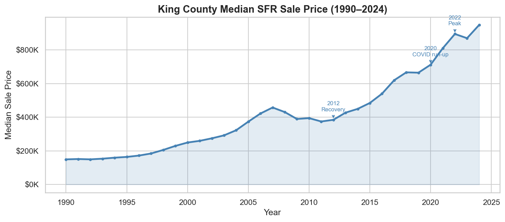
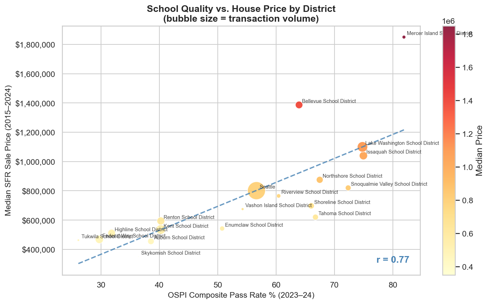
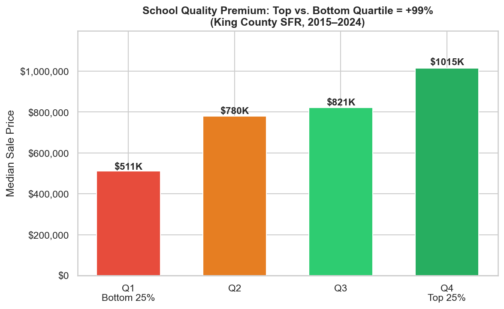
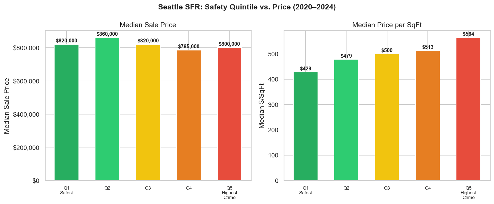

# Data Foundation
### Sources, Preparation, and Exploratory Findings — King County Housing Price Analysis

This document covers what data was used, how it was prepared, and what the exploratory analysis revealed. For full acquisition details and code, see [`data_acquisition.md`](data_acquisition.md).

---

## 1. Data Overview

Four public datasets were combined for this analysis. Each is described briefly below, including the time period covered and what was excluded before analysis.

| Dataset | Period | What was kept |
|---------|--------|---------------|
| KC Assessor — Property Sales | 2015 – 2024 | Voluntary open-market single-family home sales above $10,000, on properties with a residential building |
| KC Assessor — Building & Parcel | Full history | Single-family buildings (1 unit, 200–15,000 sq ft, built 1870–2024); all King County parcels |
| SPD Crime Incidents | 2015 – 2024 | Seattle city limits only; incidents with valid GPS coordinates (~85% of all records) |
| WA OSPI School Assessments | 2023 – 2024 | King County public schools (K–12); overall student population; main state tests (SBAC, WCAS) |
| KC GIS — School Districts & Parcel Coordinates | Current snapshot | School district boundary polygons; lat/lon for all parcels (used to assign each property to a district) |

---

## 2. Housing Price EDA

**Source:** `kc_housing_eda.ipynb` · KC Assessor (RPSale, ResBldg, Parcel, LookUp)

**Scope:** King County, WA — all cities and unincorporated areas · 2015–2024

> **SFR** (Single-Family Residence) — a standalone home on its own parcel, occupied by one household. All housing analysis in this study is restricted to SFR properties.

### 2.1 Data Preparation

| Step | What was done | Why |
|------|---------------|-----|
| Deduplication | Kept the most recent sale per parcel (PIN); kept the first building record per PIN | The same property may have sold multiple times — one row per property is needed for modeling. The most recent sale best reflects current value. Multiple building records per PIN represent secondary structures (e.g. garage unit); only the primary building is kept |
| Arms-length filter | `SaleReason=1` (open-market transaction), `PropertyClass=8` (residential land with a building on it), `SalePrice>$10K` (real price, not a symbolic transfer) → 881K records retained (36.5% of all sales) | Isolates genuine buyer-seller market transactions. Non-market sales (foreclosures, government acquisitions, intra-family $1 deeds) do not reflect what a willing buyer would pay |
| SFR filter | `NbrLivingUnits=1` (single-family, not duplex or apartment), `SqFtTotLiving` 200–15,000 sq ft (plausible size), `YrBuilt` 1870–2024 (valid build year) | Multi-unit properties follow different pricing dynamics. Size and age extremes are almost always data entry errors |
| Code decoding | `SaleReason`, `HeatSystem`, `WfntLocation` decoded via LookUp table | These fields are stored as numeric codes in the raw CSV; the LookUp table maps them to human-readable labels for analysis |
| Feature engineering | 94.9% of buildings have `YrRenovated=0` (field is blank or never renovated) — so `YrRenovated` cannot be used directly. Created `EffectiveAge = SaleYear − max(YrBuilt, YrRenovated)` | Captures how old the property actually appears: if renovated, effective age resets to the renovation year; otherwise it reflects the original build year |

### 2.2 Charts

- **Median SFR sale price by year (1990–2024)** — long-run price trajectory
- **Transaction volume + median price by month** — seasonality pattern
- **SaleReason distribution** — proportion of arms-length vs. non-market sales
- **Correlation heatmap** — SalePrice vs. living area, grade, waterfront footage, traffic noise, and view
- **SalePrice vs. SqFtTotLiving** — scatter with trend line
- **Median price and record count by building grade** — dual-axis bar + line
- **Price distribution by building grade** — box plots
- **Median price per sq ft by year** — $/sqft trend line

### 2.3 Key Findings

**Price trend & seasonality**

Median SFR price grew from ~$150K (1990) to a peak near $900K (2022), with two distinct run-ups: a post-crisis recovery (2012–2018) and a COVID-era surge (2020–2022), followed by a modest correction in 2023–2024. Transaction volume peaked in 2005–2007 and again in 2020–2021.

Transaction volume peaks in May–June and falls sharply in winter. Median price follows a similar pattern, reaching ~$630K in summer vs. ~$575K in January — a seasonal swing of roughly 10%.

---

**Building characteristics**

The stock is concentrated: Grade 7 (Average) accounts for 40.7% of all buildings, Condition 3 (Average) for 66.5%, and 3-bedroom homes are most common. Living area is right-skewed with a median around 1,990 sq ft. Most homes were built in the 1960s–70s, with another wave in the 2000s.

Living area (r = 0.52) and building grade (r = 0.51) are the two strongest predictors of sale price. Full bath count (r = 0.45) and year built (r = 0.22) follow. Lot size and traffic noise have weak direct correlations.

Building grade has a steep non-linear effect. The median price escalates from ~$400K at Grade 6 to over $4M at Grade 13. Grade 7 (Average) has the most records by far, while grades above 10 are rare and command significant premiums.

---

**Location premiums**

Waterfront properties have a median sale price of ~$1.4M vs. ~$850K for non-waterfront — a **+76.9% premium** (i.e. buyers pay roughly three-quarters more for a home on the water). The distribution is also far wider, with a long upper tail reflecting high-value shoreline parcels. Note that this is a raw comparison: waterfront homes tend to be larger and higher-grade as well, so the premium attributable purely to water location is lower — isolating that effect is handled in the price model.

Price per sq ft has risen sharply — from ~$150 in 1990 to over $450 by 2024. Homes with any view command a median of ~$800K vs. ~$600K for no-view non-waterfront homes. Waterfront properties (any view) reach ~$1.3M median.

---

## 3. School Quality EDA

**Source:** `kc_schools_housing.ipynb` · WA OSPI, KC GIS

**Scope:** King County, WA — all 20 public school districts · 2023–2024 school year

### 3.1 Data Preparation

| Step | What was done |
|------|---------------|
| Suppressed data exclusion | Schools with withheld pass rates (small enrollment) excluded before averaging |
| Composite score | Each school's Math, ELA, and Science pass rates averaged into one score |
| District aggregation | All schools within a district averaged into a single district-level score |
| Spatial join | Parcel lat/lon (from KC GIS) matched to school district boundary polygons — 100% of parcels assigned |
| District name normalization | Capitalization and punctuation standardized to align OSPI names with GIS district names |

### 3.2 Charts

- **Pass rate histograms — Math, ELA, Science** — distribution across all King County schools
- **Top 15 districts by subject pass rate** — grouped bar chart
- **Math vs. ELA correlation + composite score ranking curve** — two-panel chart
- **School quality vs. median house price by district** — bubble chart (bubble size = transaction volume)
- **Median SFR price by school quality quartile** — bar chart

### 3.3 Key Findings

> **SBAC / WCAS** — Washington State's two main standardized assessments, administered to all public school students. SBAC covers Math and ELA in grades 3–8 and 11; WCAS covers Science in grades 5, 8, and 11. Grades 9–10 are not tested under these assessments. These three subjects were chosen because they are the only ones assessed statewide with a consistent, comparable scoring standard — making them the most reliable basis for cross-school comparison.
>
> **ELA** (English Language Arts) covers reading comprehension and writing.

**Pass rate distributions**

Pass rates vary widely across King County schools — from under 10% to over 90%. The county median is 53.4% for Math, 62.8% for ELA, and 55.0% for Science. Math shows the widest spread and the lowest median, suggesting it is the most differentiating subject across schools.

**Top districts and subject correlation**

The top-performing districts (Mercer Island, Lake Washington, Bellevue, Issaquah) score consistently above 70% across all three subjects. The gap between top and bottom districts is substantial — roughly 50 percentage points on Math.

Math and ELA pass rates are tightly correlated across schools (r = 0.90), meaning a school that performs well in one subject almost always performs well in the other. The composite score — the simple average of all three subject pass rates — is shown in the right panel, with schools ranked from lowest to highest. The distribution is wide and smooth, with a clear gap between the top and bottom ends.

**School quality and house prices**

Each bubble represents one school district. The strong upward trend (r = 0.77) confirms that school quality and median home prices are closely linked at the district level. Mercer Island sits at the top right — the highest-scoring and most expensive district in the county.

Grouping districts into quartiles makes the premium concrete: the bottom 25% of districts has a median sale price of $511K, while the top 25% reaches $1,015K — a **+99% premium**. Note that Q2 to Q3 shows a smaller step ($790K → $821K) compared to Q1 to Q2 ($511K → $790K), suggesting the price premium is steepest at the lower end of school quality.

These figures are raw comparisons with no other variables controlled. High-scoring districts also tend to have larger homes, better locations, and higher incomes — so not all of the +99% is attributable to school quality alone. Isolating the school effect is handled in the price model.

---

## 4. Crime EDA

**Source:** `kc_crime_housing.ipynb` · SPD via Seattle Open Data Portal

**Scope:** Seattle city limits only (excludes King County suburbs) · 2015–2024

### 4.1 Data Preparation

| Step | What was done |
|------|---------------|
| Coordinate filtering | Retained only records with valid GPS coordinates (~85% of all SPD incidents) |
| Geographic restriction | Analysis limited to Seattle city limits; King County suburbs excluded |
| Deduplication | Most recent sale per PIN; first building record per PIN |
| Crime score computation | BallTree haversine query: counted serious crimes within 500m of each property in the 12 months before sale date |
| Neighborhood stability filter | Neighborhoods with fewer than 20 transactions excluded from aggregate analysis |

### 4.2 Charts

- **Crime heatmap — Seattle city limits** — geographic density map showing concentration by area
- **Annual crime volume 2015–2024** — dual-axis (total incidents bar + serious crime line)
- **Average monthly crime volume** — seasonality bar chart
- **Top neighborhoods by serious crime density** — bar chart
- **SalePrice vs. nearby crime count** — scatter plot with trend line (500m radius, 12-month window)
- **Median SFR price by crime exposure quintile** — bar chart (Q1 lowest to Q5 highest exposure)
- **Neighborhood crime exposure vs. price per sq ft** — bubble chart (bubble size = transaction volume)

### 4.3 Key Findings

The two panels above tell different stories. On the left, median sale price is roughly flat across all five crime quintiles (~$785K–$860K), with no clear downward trend — suggesting crime alone does not drive raw prices down. On the right, median price per sq ft actually **increases** from the safest quintile ($429/sqft) to the highest-crime quintile ($564/sqft). This is because high-crime areas in Seattle are denser urban neighborhoods where homes are smaller but land is more expensive — the crime discount is real, but it is masked by the urban density premium when looking at total price.

- Total crime volume was stable at 70–77K incidents per year from 2015–2024. Serious crime rose ~9% (2015 to 2022 peak), with violent crime up ~45% over the same period.
- The direct correlation between nearby crime and sale price is real but modest: r = −0.105 (serious crime) and r = −0.156 (violent crime).
- Urban amenities (walkability, proximity to employment and services) partially offset the crime discount in neighborhoods such as Capitol Hill and First Hill.
- Low-crime neighborhoods such as Magnolia and Laurelhurst correlate with higher prices, but their relative isolation is also a contributing factor.
